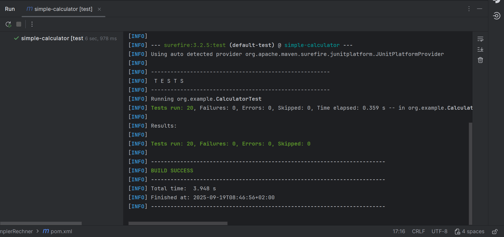

# QA & Testing – Aufgabenübersicht

---

### Aufgabe 1 / 4 – Simpler Rechner & Unit-Tests für Banken-Simulation
- **Testen der Grundrechenarten** (Addition, Subtraktion, Multiplikation, Division).  
- Tests wurden mit **JUnit 5** in IDE & Maven ausgeführt.  
- **Tests zu Ein-/Auszahlungen, Bonus, Kreditlimit, Chronologie.**  
- Abgedeckt mit **JUnit 5**, Coverage geprüft.  

---

### [Aufgabe 2 – JUnit Zusammenfassung](./aufgabe_2.md)
- Markdown-Dokument mit Übersicht über die wichtigsten **JUnit 5 Features**.  
- Kurze Anwendungsfälle / Beispiele + Referenzseite.

---

### [Aufgabe 3 – Banken-Simulation (Übersicht)](./aufgabe_3.md)
- Lokales Setup & Analyse der Bankensoftware.  
- Dokumentation: Klassen, Abläufe, Regeln in Stichworten.

---