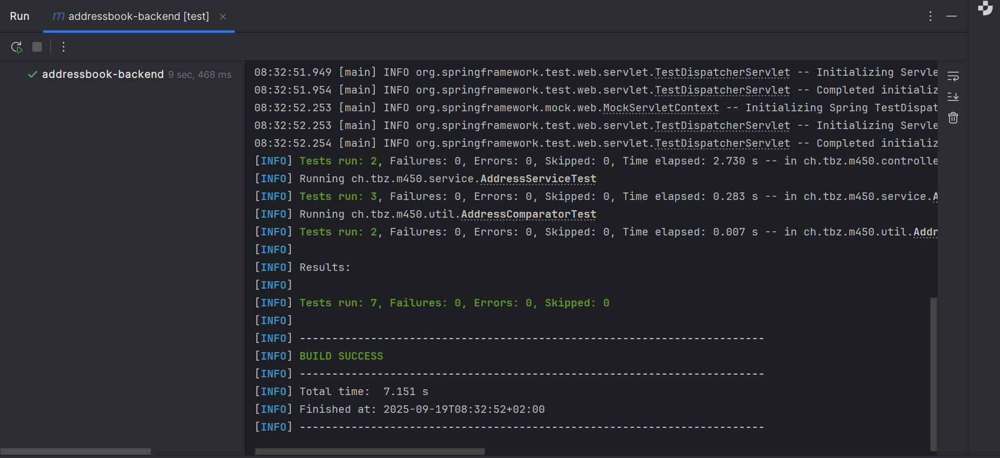

# QA & Testing – Addressbook Backend

---

### Aufgabe 1 / 2 – Tests & Comparator
- Tests für alle Klassen schreiben.  
- Verwendung von `@BeforeEach`.  
- Adressen erstellen & testen.  
- Service-Tests mit **H2-Datenbank gemockt**.  
- Comparator-Klasse korrekt implementieren.  
- Comparator-Klasse um zusätzliche Attribute erweitern.  
- Neue Funktionalität mit Tests absichern.  

---
